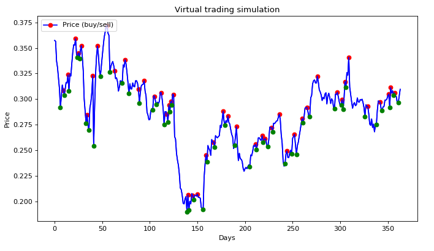
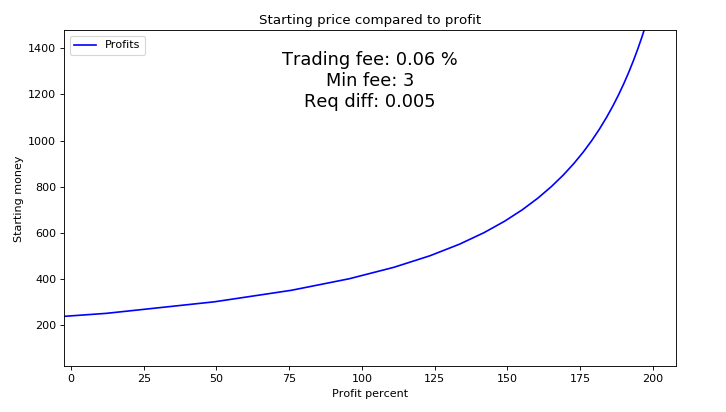
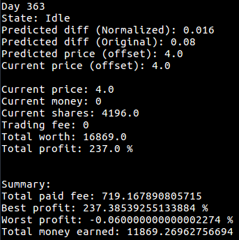
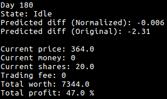

# tensorflow-scripts
Custom scripts for machine learning
### [Tensorflow models repository](https://github.com/tensorflow/models)

## Useful datasets

### [101 food categories](https://www.vision.ee.ethz.ch/datasets_extra/food-101/)

## Dataset sources

### [Wikipedia - List of datasets for machine learning research](https://en.wikipedia.org/wiki/List_of_datasets_for_machine_learning_research)


### [UCI - Machine Learning Repository](http://archive.ics.uci.edu/ml/datasets.html)


### [GitHub - awesome-public-datasets](https://github.com/caesar0301/awesome-public-datasets)


### [Kaggle](https://www.kaggle.com/datasets)


### [Reddit - /r/datasets](https://www.reddit.com/r/datasets/)

## Useful software

### [labelImg](https://github.com/tzutalin/labelImg)

## Articles

### [Understanding LSTM networks](http://colah.github.io/posts/2015-08-Understanding-LSTMs/)

# Object detection

## Commands
```
# From tensorflow/models/
protoc object_detection/protos/*.proto --python_out=.
export PYTHONPATH=$PYTHONPATH:`pwd`:`pwd`/slim

# From tensorflow/models/object_detection/
# Prepare data and train
python3 xml_to_csv.py
python3 generate_tfrecord.py --csv_input=data/train_labels.csv  --output_path=data/train.record
python3 train.py --logtostderr --train_dir=training/ --pipeline_config_path=training/ssd_mobilenet_v1_pets.config

# Export graph from trained data
python3 export_inference_graph.py \
    --input_type image_tensor \
    --pipeline_config_path training/ssd_mobilenet_v1_pets.config \
    --trained_checkpoint_prefix training/model.ckpt-xxxx \
    --output_directory x_graph
```

# Stock market prediction

## Prediction per day


Here we can see that prediction is not very accurate, but the shape is accurate enough. If we know behavior for the price, then we can predict if price is higher or lower tomorrow. Based on this prediction we can decide every day if we should sell or buy (or do nothing).

For example if price is 50 today and we own 100 shares, then total value is 5000. Neural network predicts that price will be 47 tomorrow, so total value would be 4700 tomorrow. Unless we sell before it drops. Let's imagine we sold those stocks for price of 50 and price for tomorrow is indeed 47. Now neural network predicts price of 49 for the next day, we should buy again. 5000 / 47 means 106.38 shares. When price is 49 the next day, our total value would be 49 * 106.38 = 5212, so that would be 4% profit already. So what happened here? We dodged price drop by not owning shares when it dropped and hopped back in the game just before prices began to rise again.

The point is, if we have any clue about in which direction prices will be going, we can act before it happens. We do not necessarily need to know the exact prices if we know direction.

## Virtual trading simulation



Simulation runs one day at a time and tries to predict how much price will be tomorrow compared to today's price. Based on that change AI will either buy, sell or do nothing. As we can see it has performed very optimally buying only when price is low and will rise in the future, and sell when price is about to drop.

In above graph we have points where AI decided to buy (green) and to sell (red), based on above predictions. It has incredible ability to predict when prices are about to drop and when to rise.

### Trading fee



If we use low starting money in daily trading, trading fees will be too much because of the minimum fee and it will eat up our money. Above graph suggests we should have at least 200€ for starting to not lose and not gain any money.

If trading fee is 0.06% and minimum fee is 3€, we should have 3€ / (0.06% / 100) = 5000€ for most optimal profit. If we have trading fee of 0.2% and minimum fee of 9€, then we should have 9€ / (0.2% / 100) = 4500€ for most optimal profit. These are actual trading fees from [Nordnet](https://www.nordnet.fi/palvelut-ja-tuotteet/hinnasto.html).

### Results

#### TELIA1.HE (Graphs above)


#### TSLA


Attributes per day explanation:
* State - Selling / Buying / Idle
* Predicted diff (Normalized) - Normalized value of predicted difference
* Predicted diff (Original) - Original value of predicted difference
* Predicted price (offset) - Predicted price for next day
* Current price (offset) - Last prediction (for this day)
* Current price - Current real price
* Current money - Amount of money we have right now
* Current shares - Amount of shares we have right now
* Trading fee - How much we paid trading fee this time
* Total worth - Our total worth now (shares + money)
* Total profit - Our total profit right now (shares + money)

Attributes of summary explanation:
* Total paid fee - Amount of fee we have paid in total for all transactions in that 180 day period
* Best profit - Percent for best profit we had in that 180 day period
* Worst profit - Percent of worst profit we had in that 180 day period
* Total money earned - Amount of money we have earned (not including starting money)
